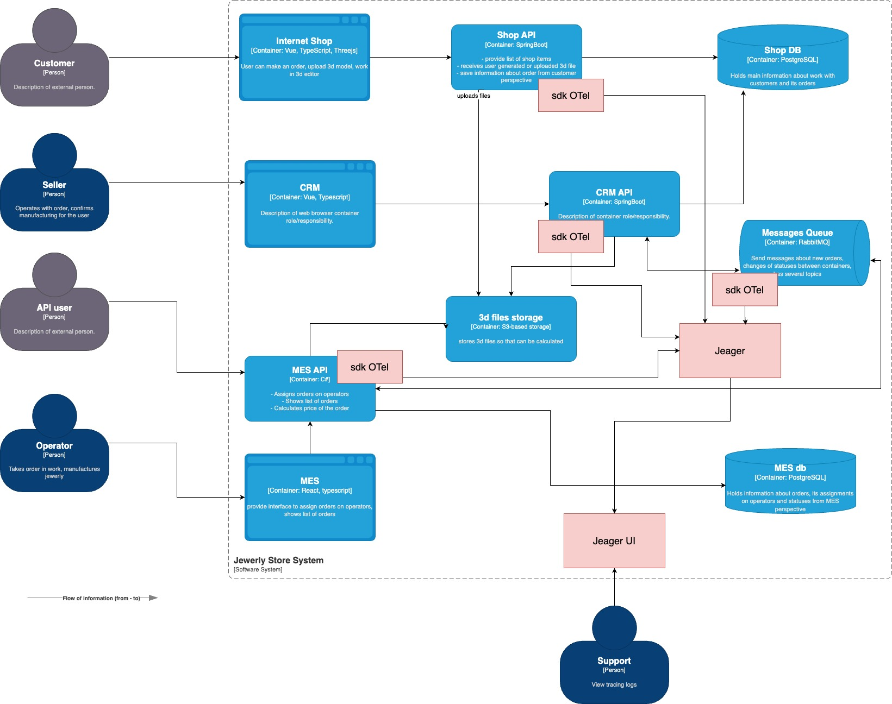

# Архитектурное решение по трейсингу

Наиболее узкое место по времени ответа судя по жалобам клиентов - MES API. MES API одновременно отвечает за присвоение заказа оператору, отображение списка заказов и расчет стоимости заказа.

### Мотивация

Трейсинг позволит определить наиболее узкое место всей системы - где именно пропадают заказы. Он поможет быстро найти существующие источники проблем и справиться с новыми вызовами. Идентификация проблемы с помощью трейсинга повлияет на:
- Скорость (время) идентификации и устранения проблемы - приведет к сокращению времени обработки запросов и количества ошибок
- Минимизация рисков потери клиентов (GMV).
- Минимизация пропасших заказов - кол-во выполненных заказов.
- Увеличение производственной мощности до 2 раз.
- Готовность к откртию MES API и обработки новых заказов - количество новых заказов.

### Предлагаемое решение

### Компромиссы

Необходимо будет настраивать OpenTelemetry sdk для C# (MES API), SpringBoot (Shop, CRM), RabbitMQ. Возможно будет сложно (по времени) добавить функциональность в MES API, так как система внешняя, несмотря на то, что есть доступ к SourceCode.

### Аспекты безопасности

Необходимо будет внедрить аутентификацию, чтобы доступ к tracing логам через UI имел только пользователь с ролью "Support". Для этого необходимо будет добавить новую роль "Support", прописать права доступа. Добавить ограничение доступа к сервису у всех других существующих ролей - Customer, Seller, API User, Operator.

