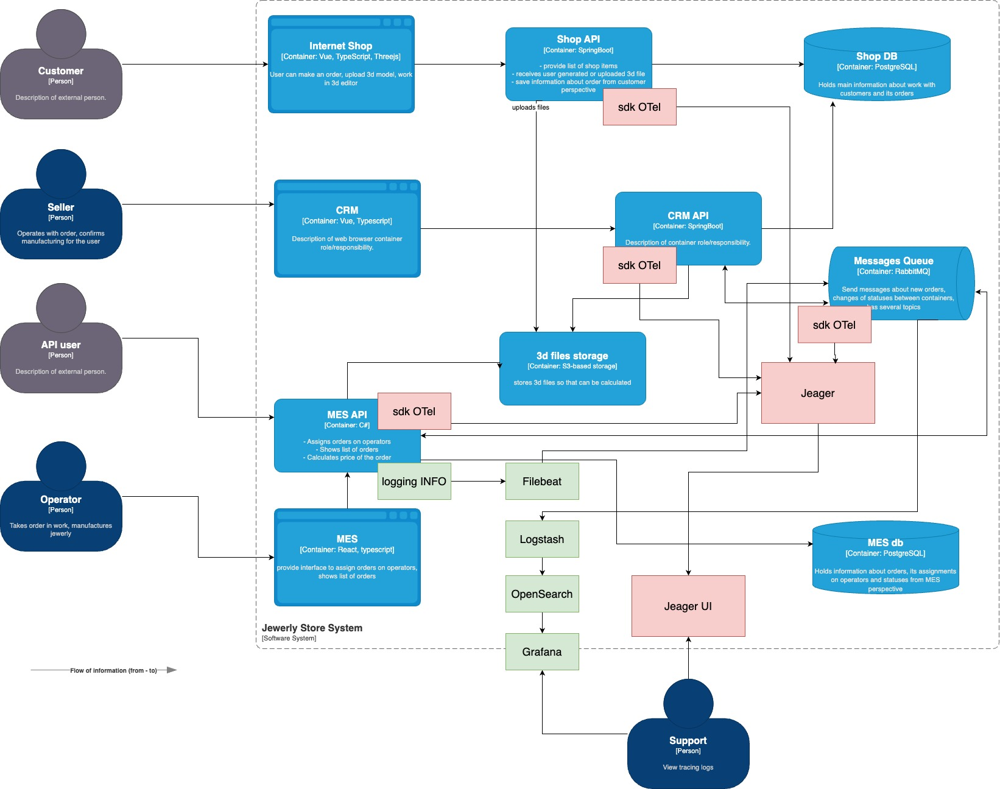

# Архитектурное решение по логированию

Наиболее узкое место по времени ответа судя по жалобам клиентов - MES API. MES API одновременно отвечает за присвоение заказа оператору, отображение списка заказов и расчет стоимости заказа. Однако место для добавления логирования в первую очередь стоит выбирать на основе данных по трейсингу и мониторингу. Если гипотеза подтвердится, что наиболее узкое место - MES API, то в него стоит добавить логирование, чтобы получить больше информации, в чем именно проблема, если данных о трейсинге недостаточно.

### Список данных для логировавния

INFO:
    - Тип запроса (отображение заказов/расчет стоимости заказа/...)
    - данные специфичные для типа запроса (номер заказа, статус заказа, фильтр запроса отображения заказо, ...)
    - Timestamp.
    - user_id.
    - ip_address.
- ERROR/FATAL:
    - Тип запроса.
    - Данные специфичные для типа запроса.
    - Error_message
    - timestamp.
    - user_id
    
### Мотивация

Трейсинг позволит определить область, где пропадают заказы. А логирование в проблемной зоне даст больше информации для идентификации причин проблем. Может выясниться, что к открытому API (не-)авторизованные пользователи могут делать очень много запросов, осуществляя DDoS атаку и засоряя очердь сервиса. В этом случае может потребоваться добавить балансировщик запросов (например API Gateway), который будет ограничивать кол-во запросов по IP адресу/для конкретных пользователей. Трейсинг + мониоринг + логирование позволит подтвердить или опровергнуть те или иные гипотезы, чтобы можно было в дальнейшем принимать те или иные решения.

Идентификация проблемы с помощью логирования повлияет на:
- Скорость (время) идентификации и устранения проблемы - приведет к сокращению времени обработки запросов и количества ошибок
- Минимизация рисков потери клиентов (GMV).
- Минимизация пропасших заказов - кол-во выполненных заказов.
- Увеличение производственной мощности до 2 раз.
- Готовность к откртию MES API и обработки новых заказов - количество новых заказов.

Трейсинг в первую очередь стоит добавить в наиболее проблемные зоны по словам пользователей - MES API, логирование - в первую очередь лучше добавить в MES API. Этим могут заняться параллельно тим лид и бекенд разработчик, так как доработки связаны с компонентом написанным на C#.

### Предлагаемое решение

Для добавления логирования можно будет использовать ELK стек. Для этого необходимо:
1. Настроить отправку логов из сервисов (например MES API) с помощью Filebeat в RabbitMQ. (Передача данных в RabbitMQ, чтобы логи нигде не потерялись).
2. Настроить LogStash на получение логов из RabbitMQ.
3. Настроить передачу из Logstash в OpenSearch (почему OpenSearch? - из-за Apache Liscence и схожестви функционала с ElasticSearch).
4. Настроить Index Lifecycle Management:
    - Создание индекса: Для каждого типа запросов (show_orders/calculate_price/assign_operator/...) и для каждого дня должен использоваться свой индекс.
    - Ролловер: max_primary_shard_size: 10Gb
    - Хранение: срок годности индекса 1 месяц.
    - Удаление: автоматически по истечению срока годности (1 месяц)
5. Настроить визуализацию логов OpenSearch через Grafana (почему Grafana? Потому что ее можно использовать одновременно для мониторинга в Prometheus).

Доступ к логам через Grafana и OpenSearch будет только у Support-а.
Чувствительные данные предполагается шифровать/хешировать 

### Система анализа логов

Настроить аллертинг при наступлении следующих событий:
    - Превышение количества ошибок выше некоторого порогового значения.
    - Увеличение количество логов в N раз за определенный промежуток времени.
