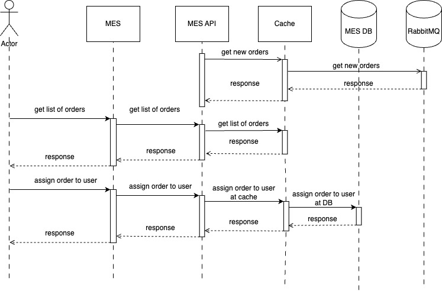

# Архитектурное решение по логированию

Наиболее узкое место по времени ответа судя по жалобам клиентов - MES API. MES API одновременно отвечает за присвоение заказа оператору, отображение списка заказов и расчет стоимости заказа.

### Мотивация

Кеширование позволит снизить нагрузку на вычислительные ресурсы, БД путем сохранения в памяти наиболее свежей информации - например информацию по актуальным заказам, базовую цену (без учета потенциальных скидов) на уже высчитанные заказы в базе данных.

Элементы системы для добавления кеширования:
- MES и MES API
- CRM (отображение списка заказов)
- SHOP (отображение списка items)

### Предлагаемое решение

- MES и MES API:
    - Отображения заказов и выбор оператором заказа - комбинация Read-Through и Write-Through подходов. Так как операторы получают деньги за выбполненный заказ, то важно сохранять консистентность данных в кеше и предоставлять актуальные данные. Также важно, чтобы если 1 оператор выбрал заказ, то это сразу отобразилось в кеше.
    - Расчет стоимости заказа - комбинация Read-Through и Write-Through подходов. Так как эта операция расчета очень дорогостоющая (от нескольких минут), то важно подерживать консистентность данных в кеше, чтобы не было кеш промахов и запрос не отправился повторно на перерасчет.
- CRM:
    - отображение списка заказов вместе со статусом - комбинация Read-Through и Write-Through подходов. Важна консинтентность данных, быстрее взять в работу заказ/подтвердить его (это влияет на время реализации заказа - бизнес-метрика) и подтверждение обновления статуса заказа в БД. Асинхронность обновления не так сильно важна.
- SHOP:
    - отображение статуса заказов, отображение каталога товаров - клиентское кеширование. Эта информация не так часто обновляется. Можно хранить на стороне клиента, чтобы разгрузить сервер.

При выборе стратегии инвалидация кеша для MES API основной акциент был сделан на поддержание актуализации/консинтентности данных о заказах и кто конкретно взял заказ в работу. Под это требование лучше всего подходят 2 стратегии инвалидации кеша:
- Инвалидация на основе изменений.
- Инвалидация по ключу.

В случае инвалидации по ключу обновляется кеш только для конкретного ключа. Тут могут возникнуть сложности при появлении новых заказов и быстрому обновлению всего списка заказов. Тем более операторы производства всегда запрашивают весь список заказов, а не какой-то конкретный заказ. Инвалидация на основе измений будет происходить всякий раз как будет приходить новый заказ или обновляться информацию по заказу с `MANUFACTURING_APPROVED` на `MANUFACTURING_STARTED`. Поэтому в качестве стратегии инвалидации кеша была <u>выбрана инвалидация на основе изменений.</u>
